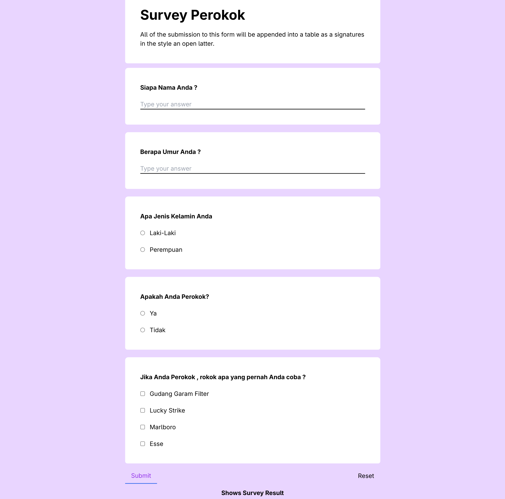
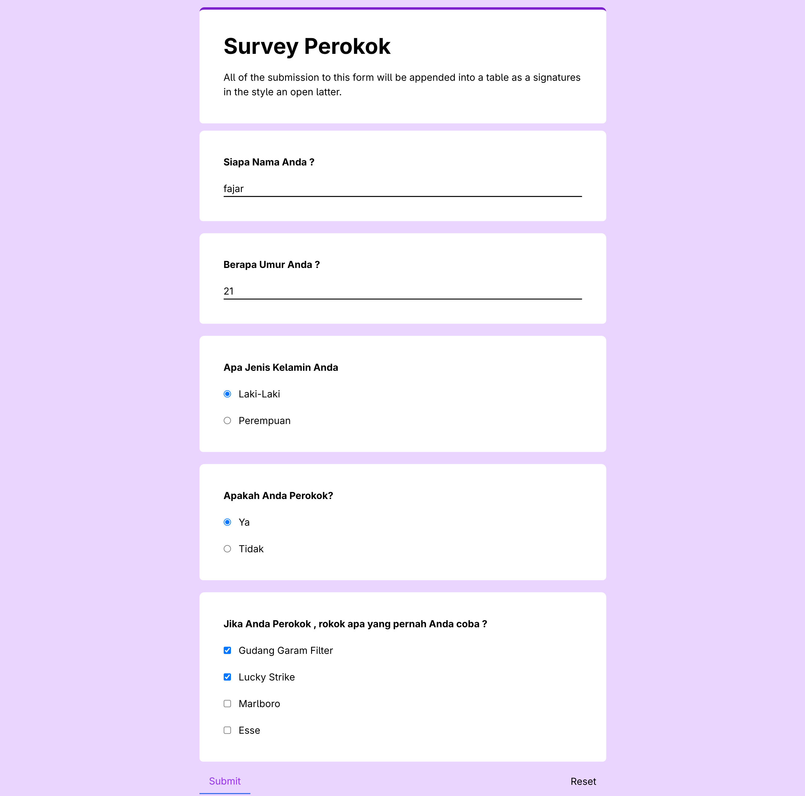
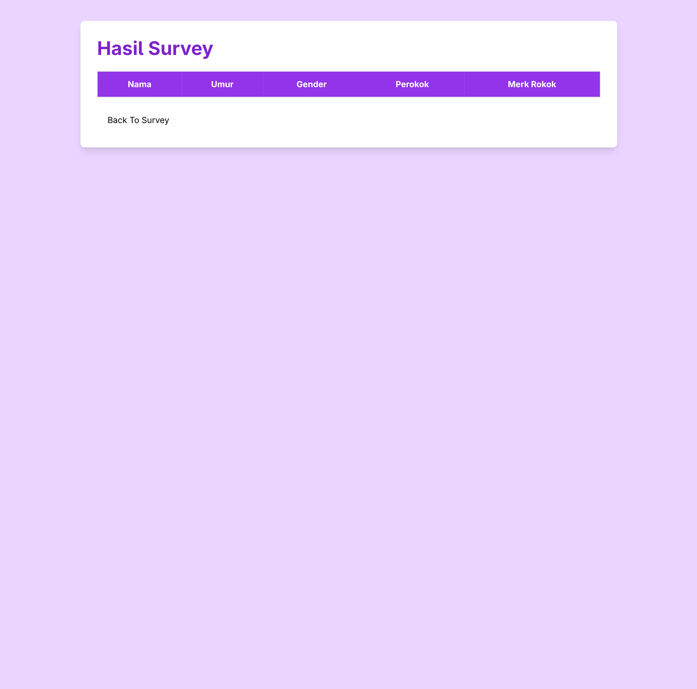
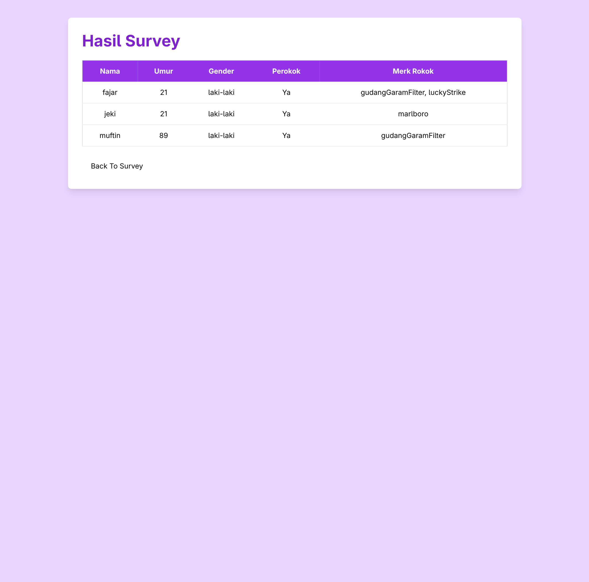

# Survey Perokok

Aplikasi survey sederhana menggunakan HTML, Tailwind CSS, JavaScript, dan jQuery.

## Screenshot

<table>
    <tr>
        <td>
            
        </td>
        <td>
            
        </td>
        <td>
            
        </td>
        <td>
            
        </td>
    </tr>
    <tr>
        <td>Form Kosong</td>
        <td>Form Input</td>
        <td>Data Kosong</td>
        <td>Data Sample</td>
    </tr>
</table>

## Tech Stack

* HTML
* Tailwind CSS
* JavaScript
* jQuery
* Local Storage

## Fitur

* Input data survey
* Penyimpanan data ke Local Storage
* Menampilkan hasil survey
* Styling menggunakan Tailwind CSS
* Manipulasi DOM menggunakan jQuery

